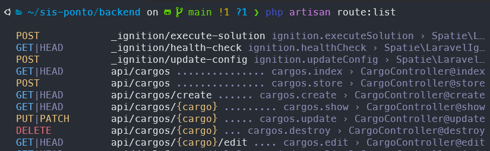
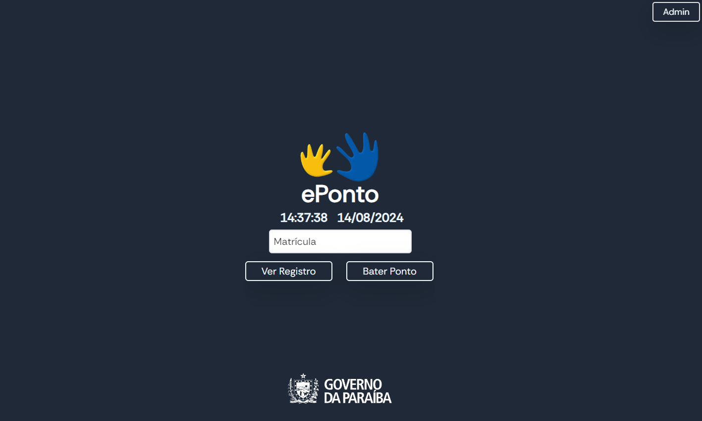
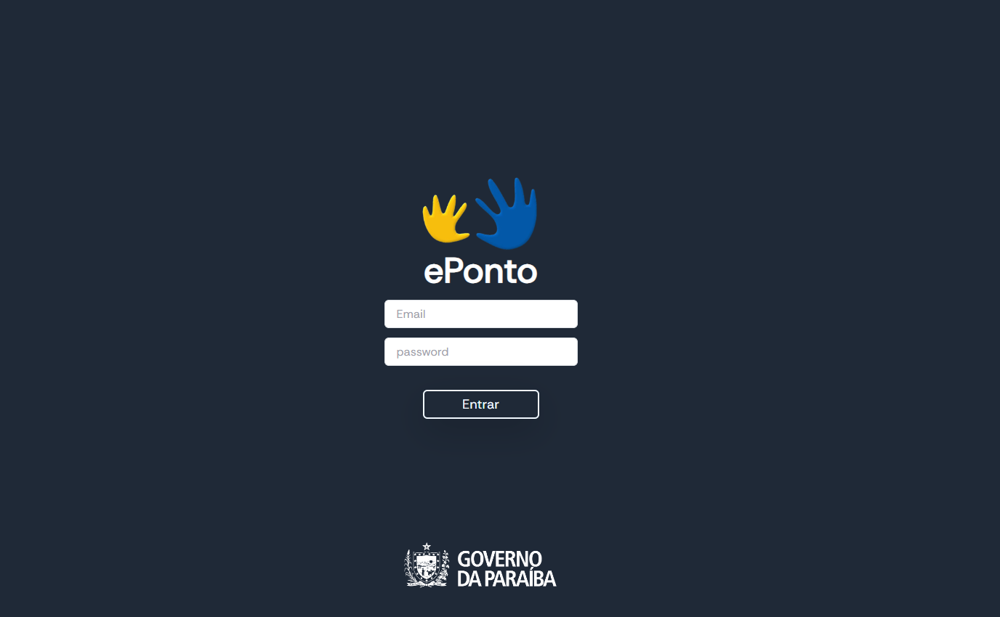
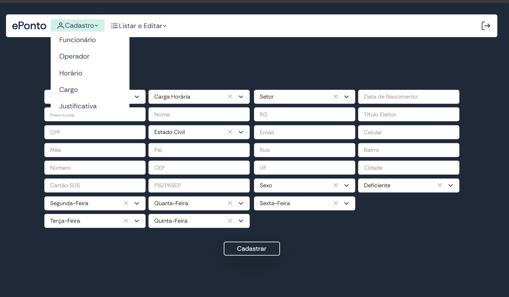
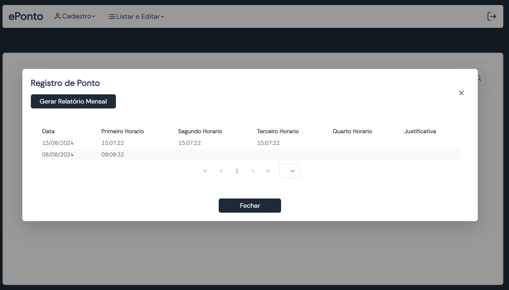

# Sistema de Ponto Eletrônico

Este repositório contém o código-fonte de um sistema web de ponto eletrônico desenvolvido para a FUNAD, utilizando Laravel para o backend e Vue.js para o frontend.

## Sobre

Sistema criado para gerenciar o registro de ponto eletrônico dos funcionários da FUNAD. Ele permite que os funcionários insiram sua matrícula para registrar entradas e saídas, ou visualizar seu histórico de ponto do dia.
No painel do admin, os operadores do RH podem cadastrar, listar e editar os dados dos funcionários, gerar relatórios do registro de ponto, cadastrar novos operadores, horários, faltas etc.

O sistema é dividido em duas partes principais:

- **Backend (Laravel)**: Gerencia a lógica de negócios, autenticação e persistência de dados. O Laravel segue o padrão MVC (Model-View-Controller), o que facilita a separação de responsabilidades e a manutenção do código. As rotas são definidas para a interação com os diferentes endpoints da API, que por sua vez acionam os controllers responsáveis por cada operação.

- **Frontend (Vue.js)**: Proporciona uma interface de usuário interativa e dinâmica. Os componentes do Vue.js são responsáveis pela renderização da interface e pela comunicação com o backend através de APIs RESTful.

É um sistema desenvolvido para ser fácil de manter e escalar, com o backend e frontend completamente desacoplados, permitindo que cada parte possa ser atualizada ou substituída sem afetar a outra.


## Modelo de Dados e Estrutura das Tabelas

Nesse [arquivo](./readmes/README_DB.md) você encontra o detalhamento das tabelas que compõem o banco de dados do sistema, incluindo colunas, tipos de dados e relacionamentos.


## Rotas

A API do backend foi projetada para gerenciar as operações do sistema de ponto eletrônico. Para saber todas as rotas, basta digitar o comando:

```
php artisan route:list
```

O output será uma lista completa das rotas, por exemplo:



## Páginas

O frontend é desenvolvido em Vue.js e apresenta as seguintes páginas principais:
- **Registro de Ponto**: Interface onde os usuários podem registrar suas entradas e saídas.

	

- **Página de Login**: Permite que os operadores façam login no sistema utilizando suas credenciais.

	

- **Painel do Administrador**: Após o login, os operadores são direcionados ao painel principal, onde podem gerenciar informações de funcionários, como faltas, horários, e outras tarefas administrativas. O painel permite visualizar, criar, editar e excluir esses dados de forma eficiente e centralizada.
	
	

## Requisitos

Para rodar este sistema de ponto eletrônico, é necessário ter os seguintes componentes instalados no seu ambiente:

1. **PHP**: Versão 8.2 ou superior.
2. **Composer**
3. **PostgreSQL**
4. **Servidor Web**: Apache ou Nginx.
   - Necessário para servir a aplicação Laravel.
5. **Node.js**: Versão 12 ou superior.
6. **npm**
7. **Postman** ou **Insomnia**

### Instalação

1. **Clone o repositório**:
   ```bash
   git clone https://github.com/gustavdlima/sis-ponto.git

2. **Backend:**
- Navegue até a pasta do backend:
	```bash
	cd backend
- Instale as dependências do Laravel:
	```bash
	composer install
- Configure o arquivo .env com as credenciais do banco de dados.
- Gere uma chave no seu .env
	```bash
	 php artisan key:generate
- Execute as migrations para criar as tabelas:
	```bash
	php artisan migrate
- Inicie o servidor localmente:
	```bash
	php artisan serv

3. **Frontend:**
- Navegue até a pasta do frontend:
	```bash
	cd frontend
- Instale as dependências do Vue.js:
	```bash
	npm install
- Inicie o servidor local do Vue.js:
	```bash
	npm run serve

### URLs de Acesso

Após a instalação e execução da aplicação:

- **Frontend**: O frontend será servido em `http://localhost:5173`
- **Backend**: O backend estará disponível em `http://localhost:8000`

### Criando a conta administradora

Para criar o primeiro usuário, você vai enviar uma request para o endpoint ***/api/users***, contendo as seguintes informações:
```
	{
	    "name": "admin",
	    "email": "admin@admin",
	    "password": "test",
	    "level": 3
	}
```

## Licença

Este projeto é licenciado sob os termos da [MIT License](LICENSE).

Você pode usar, copiar, modificar, mesclar, publicar, distribuir, sublicenciar e/ou vender cópias do software, desde que mantenha a notificação de direitos autorais original e entre em contato com o desenvolvedor responsável.

---
